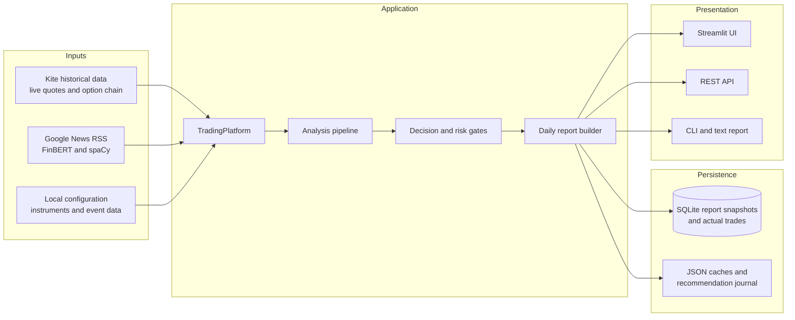
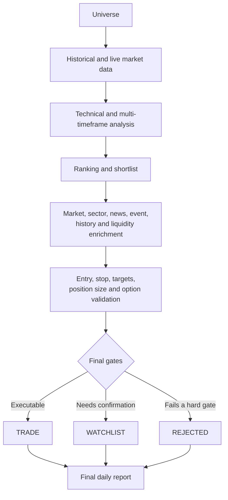
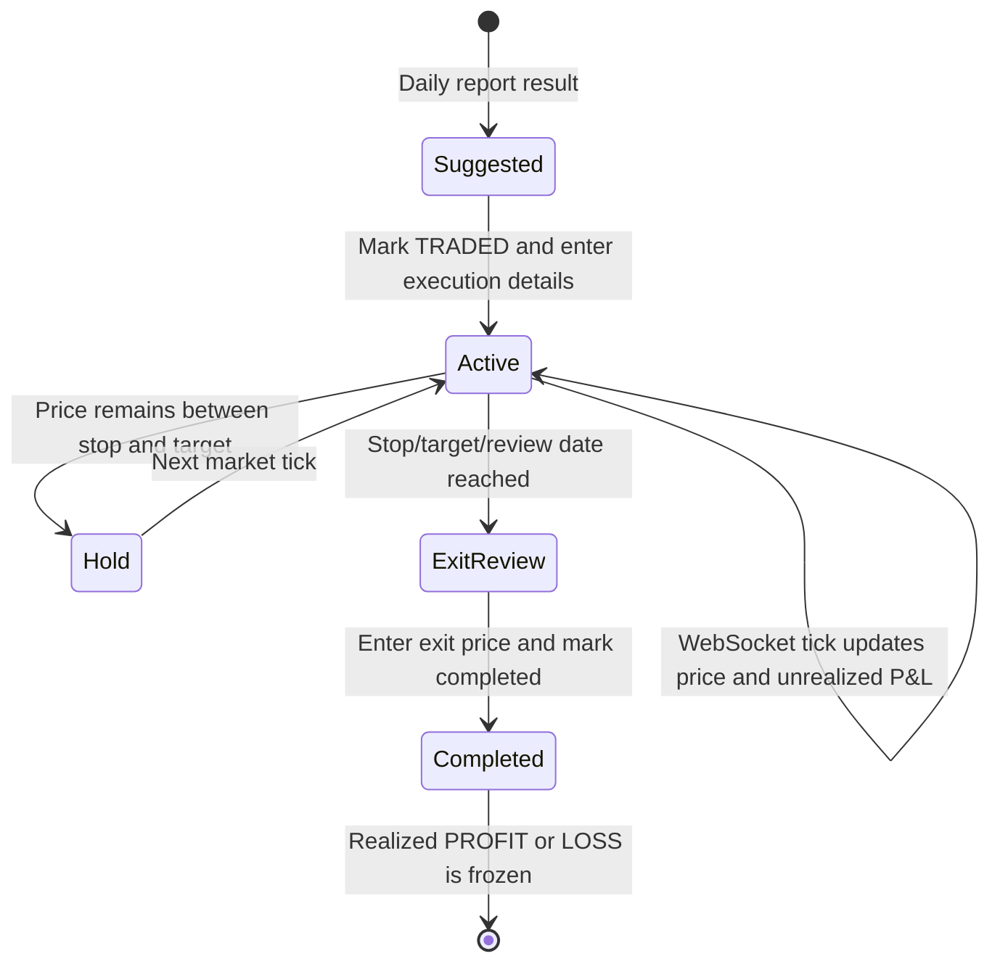

# Alphatrace

Alphatrace is an analysis-first trading platform for NSE equities. It uses Zerodha Kite for
historical OHLCV and live quotes, then provides technical analysis, trade
planning, backtesting, and a stateful paper-trading workflow.
Live order placement is intentionally not exposed by the public platform API.

## Quick start

Configure a valid daily Zerodha Kite access token in `.env`, then run:

```env
KITE_API_KEY=your_kite_api_key
KITE_ACCESS_TOKEN=your_daily_access_token
```

```bash
.venv/bin/python main.py analyze RELIANCE
.venv/bin/python main.py suggest --limit 5
.venv/bin/python main.py daily-report --limit 5
.venv/bin/python main.py backtest RELIANCE
.venv/bin/python main.py papertrade RELIANCE BUY --quantity 10
.venv/bin/python main.py portfolio
```

`suggest` now returns only futures research candidates that pass every required
company check and have an unexpired NSE futures contract. A technically strong
stock with missing evidence does not qualify. Use `suggest --technical-only`
to inspect preliminary technical candidates separately.
Normal `suggest` output explains each stock's measured strengths, exact stock
and sector PE, permitted band, borrowings, delivery baseline, ownership changes,
quarterly growth, VWAP, and source periods. Use `suggest --json` for the full
machine-readable payload. The UI includes the same detailed explanations.
The normal futures scan runs the complete daily-report pipeline: discovery and
ranking, advanced technical analysis, candlesticks, support/resistance, breakout
and entry confirmation, targeted news, market/sector context, historical checks,
and risk controls. The new fundamental and VWAP requirements are additional
gates. A company-data match alone is never an approved entry. The separate
`audit_futures_fundamentals` method audits company data on a preliminary shortlist
without claiming final entry approval.

Strict futures research checks also apply to daily reports independently of
SHADOW/LEGACY/COMPOSITE ranking. The UI's Daily report page includes a
**Find verified futures candidates** button and per-stock failure details.
The checks require positive stock PE within sector PE ±5%, daily delivery at
least the monthly baseline, debt/equity of zero, ROE and ROCE at least 15%,
FII and DII holdings at least 5% each, promoter holdings at least 40%, stable
or increasing ownership, no promoter pledge, positive revenue and profit
growth in each of the latest three quarters, very strong management commentary,
no observed material block-deal impact, a completed recent-news check with no
negative news, positive sector one-year returns, and stock returns above the
sector, and price at or above today's underlying-stock session VWAP. VWAP uses
fresh five-minute bars and volume-weighted HLC3, resets each NSE session, and
rejects unavailable, stale, or zero-volume data. It estimates trade-level VWAP;
the futures contract can trade at a different price.
Sector outperformance is a leadership proxy, not a calculation of
the stock's weighted contribution to an index. PE parity is a relative valuation
check, not an intrinsic-value estimate. No block-deal filter guarantees future
price behavior.

Thresholds are configurable with `MIN_ROE_PERCENT`, `MIN_ROCE_PERCENT`,
`MIN_FII_HOLDING_PERCENT`, `MIN_DII_HOLDING_PERCENT`,
`MIN_PROMOTER_HOLDING_PERCENT`, and `MAX_SECTOR_PE_DEVIATION`.
`STRICT_FUTURES_SELECTION` defaults to `true` for daily reports.
These screens do not execute futures trades.

Each live daily/futures scan freshly discovers **today's stocks in the news**
from Moneycontrol, Economic Times, Mint, and CNBC-TV18 publisher searches via
Google News RSS. Publication timestamps must fall on the execution date in
Asia/Kolkata and must not be in the future. Technically eligible news stocks
receive shortlist places alongside the existing discovery/ranking buckets;
news mentions never waive technical, liquidity, fundamentals, or risk checks.
Stock-specific news is fetched again for each execution, bypassing the five-minute
analysis cache, while the existing 72-hour recent-risk window is retained.

The final report compares today's article-level sentiment with the day's price
move and intended direction. Rising price with negative news, falling price with
positive news, mixed news, or news opposing the intended trade blocks approval.
News roundups mentioning several companies are used for discovery, not assigned
one aggregate sentiment per stock. Incomplete same-day verification blocks an
entry; raw headlines, publishers, links, times, and conflict reasons are retained.
Only sufficiently confident, non-neutral-dominant model results receive a
directional sentiment label. Neutral-dominant probabilities must not create
negative-news rejection reasons. Quote pages and unrelated or multi-company
headlines are filtered before stock-specific sentiment analysis. A model label
is distinct from independent verification of an adverse company development.

**Public company data:** the default provider combines Screener's financial
statements and shareholding tables, Moneycontrol's stock/sector PE and block-deal
history, NSE's security-wise delivery archives, NSE pledge disclosures, and
company earnings-call PDFs linked from Screener. Delivery uses the latest
completed session and a volume-weighted baseline over the preceding 20 trading
sessions, excluding that latest session. Quarterly results compare each of the
latest three quarters with the same quarter one year earlier. Reported
borrowings take precedence over a rounded debt/equity ratio. All fields retain
source URLs, reporting periods, and calculation bases. Consolidated results are
preferred; a standalone fallback is explicitly labelled.

Public pages and immutable reports are cached with bounded requests. Filings
outside the accepted reporting windows do not count as current evidence.
Commentary strength is a conservative rule-based interpretation of management's
prepared remarks, with positive themes and negative flags recorded; it is not a
company-reported metric. Any reported block deal in the preceding 30 days is
conservatively flagged for review, rather than claiming no causal price impact.
Sources that fail or omit a field do not make that field pass. A different
published-data provider can be passed through `fundamental_provider`.

Each `daily-report` run deletes the previous `reports/daily_report.log`, then
writes both runtime messages and the complete final report to a fresh file.
Use `--log-file PATH` to choose another location. To restrict all option-chain
lookups to one expiry month, pass the month in `YYYY-MM` form:

```bash
.venv/bin/python main.py daily-report --limit 5 --option-month 2026-08
```

Without `--option-month`, expiry selection retains its normal automatic
nearest-expiry behavior. The REST endpoint supports the same filter through
`GET /daily-report?option_month=2026-08`.

Runtime defaults can be configured without changing source code:

```bash
export TRADING_CAPITAL=100000
export TRADING_RISK_PERCENT=1
export MARKET_DATA_SOURCE=kite
export OPTION_CAPITAL=2500000
export OPTION_RISK_PER_TRADE=100000
```

## Application API

`TradingPlatform` is the supported integration point for scripts and services:

```python
from src.application import TradingPlatform

platform = TradingPlatform()
suggestions = platform.suggest_stocks(limit=5)
report = platform.analyze("RELIANCE")
backtest = platform.backtest("RELIANCE")
order = platform.paper_trade("RELIANCE", "BUY", quantity=10)
```

Start with `suggest_stocks()` to rank the configured market universe. Candidates
are filtered to actionable BUY, BUY ON DIP, or WATCH setups and include a trade
plan and suggested risk-based quantity. It normalizes symbols, validates
orders, calculates a position size from the configured capital/risk limit, and
raises clear application errors when data is unavailable or input is invalid.

## REST API

Install the dependencies, then start the API:

```bash
.venv/bin/pip install -r requirements.txt
.venv/bin/python -m spacy download en_core_web_sm
.venv/bin/uvicorn src.api:app --reload
```

News analysis runs locally without a paid API. FinBERT classifies each
headline and description as positive, negative, or neutral, while spaCy
extracts named entities such as companies, people, and locations. The first
live analysis downloads `ProsusAI/finbert` from Hugging Face and caches it;
subsequent analyses reuse the local model. Override the defaults with
`NEWS_FINBERT_MODEL` and `NEWS_SPACY_MODEL` if required.

Available endpoints are `GET /health`, `GET /suggestions`, `GET /daily-report`, `POST /analyze`, `POST /backtest`,
`POST /papertrade`, `POST /outcomes`, and `GET /portfolio`. Request bodies for the first two are
`{"symbol": "RELIANCE"}`; paper trading also accepts `side` and optional
`quantity`.

`MARKET_DATA_SOURCE=cache` is available only as an explicit offline fallback
for development; it is not the default.

The local instrument file is used only to map a symbol such as `RELIANCE` to
Kite's instrument token. Candle/price data used in analysis comes from Kite on
each request.

This project is for research and paper trading. It does not constitute
investment advice.

## Strict futures stock-quality screening

Daily-report candidates must pass verified quality checks before being
recommended: stock P/E within 5% of sector P/E, delivery at or above its
monthly average, zero debt-to-equity, ROE and ROCE of at least 15%, positive and stable or
increasing FII/DII/promoter holdings, positive revenue and profit growth in
each of the last three quarters, very strong management commentary, no
material block-deal price impact, no recent negative news, positive one-year
sector return, and stock outperformance versus its sector over one year.
Price must also be above VWAP, with a sufficiently strong trend and stable
price/volatility behaviour. Any negative aggregate or article-level news
sentiment blocks selection. Incomplete or unavailable checks fail closed; they
are not treated as passes.

Configure the P/E band and return thresholds with `MAX_SECTOR_PE_DEVIATION`,
`MIN_ROE_PERCENT`, and `MIN_ROCE_PERCENT`. The current NSE quote provider
supplies only P/E and latest delivery data; it does not provide the monthly
delivery baseline, ownership changes, quarterly results/commentary, or
block-deal impact. Until those inputs are supplied by a verified data provider,
the corresponding checks remain unavailable and candidates are not eligible.
VWAP must likewise be present in the live market data or current-session
recovery analysis; missing VWAP, weak trend, or unstable price behaviour blocks
selection.

## Windows 10 local UI

The local interface uses Streamlit and stores generated report snapshots in
SQLite at `data/ui/stock_analyzer.db`. Analytical decisions still come only
from `TradingPlatform`; the UI does not duplicate scoring logic or expose live
order submission.

1. Install 64-bit Python 3.12 and select **Add Python to PATH** during setup.
2. Open Command Prompt in the project directory.
3. Run `setup_windows.bat` once.
4. Copy `.env.example` to `.env` and enter the current Kite API key and daily
   access token. Never commit this file.
5. Double-click `run_ui.bat`, or run it from Command Prompt.
6. Open `http://localhost:8501` if the browser does not open automatically.

For an offline demonstration, set `MARKET_DATA_SOURCE=cache` in `.env`. Cache
mode cannot provide live relative strength, sector indices, news, quotes, or
option-chain validation and reports those inputs as unavailable.

The UI provides:

- a summary dashboard and recent report history;
- end-to-end daily report generation with configurable limit and minimum score;
- candidate, rejected-candidate, context, dependency-health, text, and JSON views;
- single-symbol analysis;
- SQLite-backed immutable report snapshots and downloadable JSON.
- a report-grounded AI Analyst that can explain the current candidate, risk, and safe project source;
- a guarded Codex Developer workspace with read-only explain/propose modes and an explicitly
  confirmed implementation mode;
- a read-only MCP server exposing the same candidate and project-context tools.

## AI Analyst, MCP, and Codex

The AI Analyst offers five providers:

- **Google Gemini** (default): optional embedded assistant using a Google AI Studio key, with a
  limited free tier on supported models;
- **Codex via ChatGPT Plus**: uses an authenticated Codex CLI and plan limits, without
  requiring an OpenAI API key;
- **OpenAI API**: optional embedded assistant with separately billed API usage;
- **Local model (Ollama)**: runs on your computer without OpenAI API charges;
- **ChatGPT via MCP**: keeps the conversation in ChatGPT while exposing bounded read-only project
  and report tools.

The OpenAI API provider uses these optional values:

```env
OPENAI_API_KEY=your_openai_api_key
OPENAI_ANALYST_MODEL=gpt-5.6-terra
```

The Gemini provider uses these optional values. Keep the key server-side; unpaid-tier prompts and
responses may be used by Google to improve its products, so do not send confidential information.
Current-news questions can use Gemini's Google Search grounding and include source links; search
grounding is subject to Google's separate availability, quota, and pricing rules.

```env
GEMINI_API_KEY=your_google_ai_studio_key
GEMINI_ANALYST_MODEL=gemini-3.5-flash
GEMINI_FALLBACK_MODEL=gemini-3.1-flash-lite
GEMINI_WEB_SEARCH=always
```

The key remains server-side. Assistant context excludes `.env`, credentials, `.git`, caches,
market-data files, and arbitrary filesystem paths. The analyst reads saved report snapshots and
bounded safe source snippets; it cannot place orders or change analytical decisions.

Run the same read-only tools as an MCP server over standard input:

```bash
.venv/bin/python run_mcp.py --transport stdio
```

For a ChatGPT developer-mode app, run the streamable HTTP transport behind an authenticated HTTPS
endpoint or secure development tunnel:

```bash
.venv/bin/python run_mcp.py --transport streamable-http
```

The Streamlit Codex workspace requires an installed and authenticated Codex CLI on the server.
Set `CODEX_EXECUTABLE` only when it is not available as `codex` on `PATH`. Its modes are:

```bash
npm install -g @openai/codex
codex
```

Choose **Sign in with ChatGPT** when prompted. On Windows PowerShell, use `npm.cmd install -g
@openai/codex` if `npm` is not directly executable. ChatGPT subscriptions and API billing are
separate.

- `EXPLAIN`: read-only inspection and explanation;
- `PROPOSE`: read-only diagnosis and patch plan;
- `IMPLEMENT`: repository writes only after an explicit UI confirmation.

Codex is instructed not to read secrets, place trades, push, deploy, install dependencies, or use
network access. Review the Git diff and test result after every implementation run. Keep this
developer workspace private; do not expose it as a public unauthenticated page.

To stop the UI, close its Command Prompt window or press `Ctrl+C`.

The UI disables Streamlit's Python module watcher because Hugging Face
Transformers exposes optional computer-vision modules that reference
`torchvision`. The project uses text-only FinBERT and does not require
`torchvision`; disabling the watcher prevents misleading `ModuleNotFoundError:
torchvision` messages without installing an unrelated vision stack.

## Sensibull results calendar

The optional Sensibull calendar scraper uses Playwright because the calendar is
rendered in the browser. After installing `requirements.txt`, install Chromium
and its Linux runtime dependencies once:

```bash
python -m playwright install chromium
python -m playwright install-deps chromium
python sensibull_results_calendar.py
```

The scraper writes the extracted rows to
`data/cache/events/sensibull_results_calendar.json`.

## Architecture and data flow

The application is split into four layers. `TradingPlatform` is the supported
facade between the UI/API and the analytical code, so Streamlit only presents
results and records user actions; it does not make independent trading
decisions.



### Daily analysis pipeline

A daily report follows this sequence:

1. Load the configured NSE/F&O universe and obtain historical OHLCV data.
2. Calculate technical indicators, trend, momentum, volatility, volume,
   support/resistance, candlestick evidence, and relative strength.
3. Rank the universe and shortlist the strongest candidates for deeper review.
4. Enrich shortlisted stocks with market regime, sector strength, news
   sentiment, event risk, historical behaviour, and liquidity evidence.
5. Build an equity trade plan containing entry, stop-loss, targets,
   risk/reward, and risk-based position size.
6. When Kite option data is enabled, validate expiry, strikes, liquidity,
   structure, pricing, and final option approval.
7. Apply final quality and execution-readiness gates. Each candidate is placed
   in `trades`, `watchlist`, or `rejected`; the system never forces a trade to
   satisfy the requested limit.
8. Save the complete immutable report JSON to SQLite and present the same
   result through Streamlit, REST, CLI text, and downloadable JSON.

Price-action structure is represented as scored supply and demand ranges, not
only exact support/resistance prices. Zones are built from confirmed swing
bases, departure strength, formation volume, freshness, and retests. When the
latest daily candle falls beyond the larger of `RECOVERY_SHOCK_FLOOR_PERCENT`
or `RECOVERY_SHOCK_ATR_MULTIPLE × ATR%`, the stock remains a reversal-watch
candidate rather than being automatically accepted or rejected. A bullish
trade then requires 15-minute evidence: demand must hold, selling must
stabilize, a higher low and swing-high break must form, price must hold above
VWAP, green volume must dominate recent red volume, nearby supply must leave
adequate clearance, and the confirmed entry must retain the configured
reward/risk. The report exposes `FALLING_KNIFE`, `AT_DEMAND`, `STABILIZING`,
`RECOVERY_BUILDING`, `REVERSAL_CONFIRMED`, and `FAILED_REVERSAL` states.



### Suggested trade and live-position lifecycle

Marking a stock as traded from its suggestion card creates an `actual_trades`
record immediately. The user supplies the actual entry price, quantity, trade
date, and hold/review date; the report's stop-loss and first target are copied
into the tracked position. No second entry in Trade Tracker is required.

In Kite mode, one shared `KiteTicker` WebSocket subscribes to the instrument
tokens for all active equity positions. Incoming ticks are stored in a
thread-safe in-memory cache. The Streamlit fragment redraws once per second
from that cache, without requesting a quote on every redraw. If the WebSocket
is connecting or unavailable, a rate-limited REST quote provides the fallback.
Completing a position removes it from active subscriptions and freezes its
realized P&L.



### How final results are displayed

| Result | Where it appears | What is shown |
|---|---|---|
| Daily summary | Dashboard and Daily report | Stocks scanned, candidates reviewed, generated trades, watchlist count, and market regime |
| Executable candidate | Daily report → Candidates | Final action, quality, readiness, entry, stop-loss, targets, risk/reward, and approved option structure when available |
| Watchlist or rejected candidate | Daily report → Candidates/Rejected | Current analytical status and the reasons or confirmation gates that prevented execution |
| Active position | Daily report and Trade Tracker → Live Positions | WebSocket price, live P&L in rupees and percent, PROFIT/LOSS state, stop/target distance, HOLD/EXIT guidance, hold-until date, and latest tick time |
| Completed position | Suggestion card and Trade Tracker history | Exit date, exit price, fees, final realized P&L, and final PROFIT or LOSS outcome |
| Full audit result | History, text, and JSON tabs | Immutable input context, scores, evidence, rejection reasons, dependency health, and the complete report payload |

The live UI is advisory and journal-oriented. `HOLD`, `EXIT`, `BOOK PROFIT`,
and `REVIEW` describe the stored trade plan relative to the latest price; they
do not submit, modify, or close an order at Zerodha. A trade becomes completed
only when the user records its exit in the UI.

## Daily recommendation report

`daily-report` is the end-to-end output: it scans the configured universe,
risk-reviews the top 20 ranked candidates, generates entry/stop/target/position
size details, enriches finalists with live option-chain intelligence when Kite
is enabled, and prints a market summary. Add `--json` for the equivalent
machine-readable report. It never submits live orders.

For live Kite reports, Google News RSS is collected only for shortlisted
stocks. FinBERT sentiment adjusts the unified score and estimated probability,
and the report includes source headlines plus spaCy entities. The system does
not fall back to hard-coded positive/negative keyword lists when local models
are unavailable. Cache mode intentionally does not fetch external news.

The reported probability is a documented heuristic until it has been
calibrated with recorded out-of-sample trade outcomes; it is not a promise of
performance.

Each daily recommendation receives a `recommendation_id`. After closing the
paper trade, record the result with `main.py record-outcome ID WIN` (optionally
add `--return-percent`, `--exit-price`, `--mfe-percent`, and `--mae-percent`).
The outcome store also records the predicted probability, entry, stop, targets,
readiness, expected value, probability error, and Brier score. Once at least 20 completed outcomes exist for a
strategy, the report blends its observed win rate into the estimated
probability; 200 outcomes is the report's validation milestone.

Setup quality and execution readiness are independent. Quality uses technical
score 25%, trend/momentum 20%, relative strength 15%, reward/risk 15%, expected
value 10%, probability 10%, and liquidity/trust 5%; market, news, options,
sector availability, and entry timing cannot lower that grade. Readiness uses
execution/context evidence and modest regime-specific execute thresholds.
Historical checks remain neutral until `CALIBRATION_MIN_OUTCOMES` (default 200).
Candidate ordering defaults to expected value and can be changed with
`CANDIDATE_RANKING_MODE=EXPECTED_VALUE|QUALITY_SCORE|AI_SCORE|READINESS`.
The daily report risk-reviews the top 20 ranked stocks by default, independently
of the final trade `--limit`. Override this with `RANKING_SHORTLIST_SIZE` (1–30).
Equity setups use confidence-aware reward/risk floors: A-grade 1.5
(`EQUITY_MIN_RISK_REWARD`), B-grade 1.3
(`EQUITY_B_GRADE_MIN_RISK_REWARD`), and watchlist/C-grade 1.2
(`EQUITY_WATCHLIST_MIN_RISK_REWARD`).

### Event risk

The daily workflow builds one shared event context, then assesses company,
scheduled-calendar, commodity, macro, geopolitical, sector, and market-wide
risk for every finalist. Event risk never changes technical or quality scores.
It retains base readiness/probability/position size and reports separately
adjusted readiness, probability, event size multiplier, overnight eligibility,
strategy restrictions, matched events, freshness, and decay.

Cached inputs live under `data/cache/events/`: `events.json`,
`company_calendar.json`, `economic_calendar.json`, `commodity_snapshot.json`,
and `manual_overrides.json`. Each uses an `events` array except the commodity
snapshot. Manual events support `enabled`, `expiry_time`, `reason`,
`created_by`, and `test_only`; test-only overrides require
`EVENT_ALLOW_TEST_OVERRIDES=true`. Writes made through `EventRepository` are
atomic and schema-versioned.

Important settings include `EVENT_RISK_ENABLED`, `CRUDE_DAILY_MOVE_WARNING`,
`CRUDE_DAILY_MOVE_HIGH`, `CRUDE_DAILY_MOVE_EXTREME`,
`COMMODITY_ZSCORE_HIGH`, `COMMODITY_ZSCORE_EXTREME`, event position
multipliers, freshness penalties, half-lives, hard-block scores, and
`EVENT_DEFINED_RISK_OPTIONS_ONLY_AT_HIGH`. Company and sector exposure
coefficients are maintained in `resources/event_risk_config.json`.

Sector coverage is enforced by tests: every symbol in the cached F&O universe
must have an explicit entry in `resources/sector_mapping.csv`, and every mapped
sector must have an event-sensitivity profile. The current matrix maps all 210
cached symbols across 38 active sectors and contains 45 profiles including
aviation, chemicals, shipping, logistics, real estate, tyres, textiles,
telecom, insurance, exchanges, fintech, defence, hospitality, restaurants,
renewables, mining, electronics, apparel, beverages, and asset management.
Company-type overrides handle materially different businesses within the same
sector, such as upstream versus oil marketing and renewable versus thermal
power.

## Intraday futures execution requirements

Strict `suggest` and `daily-report` selection now additionally requires every
intraday futures check to pass. These checks use the nearest unexpired NFO
futures contract's fresh quote and its own historical candles, retaining the
existing fundamental, delivery, news and technical requirements. Futures margin
is excluded from this new screen; no margin lookup or order is submitted.
The report shows the selected expiry, measured values, PASS/FAIL/UNKNOWN and
reason codes. A failed or unavailable required check prevents approval.

Default thresholds (configurable using `FUTURES_` plus the uppercase field
name in `src/quality/futures_execution.py`):

| Check | Default requirement |
|---|---|
| ATR (14), Wilder smoothing | Completed daily ATR 0.3–5% and five-minute ATR 0.03–1% of futures price |
| Futures session VWAP | Long price at/above VWAP; short price at/below VWAP; HLC3 volume-weighted estimate |
| RVOL | At least 1.2× cumulative volume in matched completed five-minute buckets; at least five prior sessions, up to 20 |
| OI | Long buildup for longs / short buildup for shorts; price and OI compared with the same expiry's previous completed session |
| Bid/ask spread | At most 0.05% of bid/ask midpoint; valid two-sided futures book |
| Market depth | At least five contract lots on each side across displayed depth levels |
| ADX (14) | Greater than 25 on five-minute futures bars |
| RSI (14) | Long: strictly 50–70; short: strictly 30–50; Wilder smoothing |
| Supertrend | Direction agrees with trade; five-minute ATR (14), multiplier 3 |
| EMA 9/21 | Long price > EMA9 > EMA21; reverse for shorts, on five-minute futures bars |
| Sector relative strength | Aligned 20-session underlying return above sector index for longs, below for shorts |
| Support/resistance room | Underlying level offers at least 0.3% plus futures spread; explicitly a proxy, not a futures-native level |
| Opening gap | Absolute futures gap at most 3%; price follows through in the intended direction from the open |
| Event risk | Complete source coverage, low/very-low risk, no hard block or active scheduled results/corporate-action risk; stale/delayed coverage cannot pass |

The 0.3% target-space test does not estimate brokerage, taxes or slippage.
Quotes older than five minutes, closed-market snapshots, invalid depth, missing
OI baselines, incomplete current-session candles, and insufficient history do
not count as verified execution evidence. At least 28 completed current-session
five-minute bars are required; the screen cannot approve early-session entries.
A new expiry without enough same-contract daily history remains unverified.
Kite quote and historical formats follow the official
[market quotes](https://kite.trade/docs/connect/v3/market-quotes/) and
[historical candles](https://kite.trade/docs/connect/v3/historical/) documentation.

## Command snapshots

### Independent intraday LONG/SHORT futures scanner

The CLI, REST API and Streamlit page now default to **LIVE_SCAN**. Prepare data
first; a cold or expired preparation cache produces UNKNOWN research/history,
never an automatic full research/backtest run during live scanning.

```bash
.venv/bin/python main.py futures-scan --mode FULL_RESEARCH --limit 5
.venv/bin/python main.py futures-scan --mode DAILY_PREP --limit 5
.venv/bin/python main.py futures-scan --mode LIVE_SCAN --limit 5
```

FULL_RESEARCH prepares the entire configured universe and independently
backtests both sides, storing company facts, dated market fields, candles,
news semantics and historical results in SQLite under `.cache/futures_prepared`.
DAILY_PREP overlaps the last available candle period, merges revisions and new
bars, refreshes news/events/sectors and market-sensitive company fields, and
recomputes backtests only when their candle/config/cost inputs change or expire.
Financial-cache expiry is not extended by daily market-field updates. Financial
facts expire weekly or are invalidated by changed material news. Delivery can
include the just-completed session during after-close preparation. Market-field
caches expire at the next trading session's close, accounting for configured
holidays/weekends.

LIVE_SCAN keeps every configured symbol eligible in both directions. It reads
prepared facts/statistics, batches underlying/futures/index quotes, updates only
needed candle ranges, refreshes news collection within a bounded budget, and
reuses semantic analysis only when the complete article fingerprint matches.
New/changed unchecked stories produce UNKNOWN and a pending-news cache entry;
they are not treated as neutral or safe. Daily/full preparation performs that
semantic analysis. Events are reassessed from the existing event/news sources
with original coverage and freshness rules. All original company thresholds,
LONG/SHORT filters, VWAP/volume/volatility/liquidity gates, and report formats
remain. Prepared modes add mandatory fresh read-only margin/funds validation.
The margin calculation endpoint does not submit an order.

The approved strategy uses **Futures entry prices**: LONG target/stop are
entry × 1.003 / entry × 0.998; SHORT target/stop are entry × 0.997 / entry × 1.002.
`FUTURES_RUNTIME_MOVEMENT_BASIS=FUTURES` is required; the former UNDERLYING
execution setting fails explicitly. Equity prices and levels remain research
context. Fresh depth supplies a modeled entry reference, never an actual fill.
Broker-confirmed opening fills have separate weighted entry/target/stop fields
in the read-only reconciliation ledger. Missing/stale depth never supplies an
executable price. Strategy barriers are unrounded mathematical levels, not
submitted exchange orders; tick size is retained where available.
Historical rates remain empirical frequencies, not future probabilities.

Kite requests have bounded timeouts/retries, quote pacing >=1 second and
historical pacing >=1/3 second. Live requests stop starting when their deadline
cannot accommodate the timeout. Source failures preserve UNKNOWN rather than
blocking other symbols. Reports retain A/B/C and add stage durations, request
counts, cache/quote/news timestamps, sample size and net expectancy. Operational
settings use `FUTURES_RUNTIME_*` in `.env.example`; trading thresholds are separate.

The measured simulated-feed benchmark scanned 214 symbols in 25.40 seconds
with warm candles and 99.97 seconds with incremental updates. In the 12-symbol
same-input reference comparison, ranked decisions and historical rates matched,
with 34.77 seconds versus 3.82 seconds. Live backtests were zero. These figures
are not a real-market SLA. Details and limitations are in
[`reports/futures_scan_performance.md`](reports/futures_scan_performance.md).

[`config/futures_scanner.cron`](config/futures_scanner.cron) contains a UTC-host
schedule corresponding to Saturday 10:00 IST full research, weekdays 18:10 IST
daily preparation and 09:35/09:40/09:45 IST live scans. The report-writing runner
is `scripts/run_futures_mode.py`. The schedule is supplied for installation on
an always-running host; it is not installed automatically. Valid Kite access
and successful preparation are prerequisites for an actionable morning report.
Direct `scanner.scan(mode=None)` remains the reference path for backward
compatibility and controlled comparisons; operational callers should select a
prepared mode.

```bash
.venv/bin/python main.py futures-scan --limit 5
.venv/bin/python main.py futures-scan --limit 5 --json
.venv/bin/python main.py futures-backtest --candles contract_5minute.csv --lot-size 500
```

The Streamlit **Futures LONG / SHORT** page exposes the same scanner in a
background job, with separate bullish, bearish and combined-approved tabs plus
Markdown and full-universe JSON downloads. The REST endpoint is
`GET /futures-opportunities?limit=5&include_backtest=true`. Existing `suggest`,
`daily-report`, bullish engines, and their report formats remain available.

Discovery evaluates every configured equity symbol independently in both
directions; index futures are excluded. It never consumes the bullish
shortlist. Each direction has its own configurable execution-review budget
(20 by default); the JSON audit retains every discovered symbol and explains
which candidates were outside that budget. Daily discovery includes EMA9/21/
50/200 alignment, Wilder RSI/ADX/DI/ATR, MACD, directional volume, higher/lower
structure, breakdown/breakout, rejection/reversal patterns and Nifty/sector
relative performance. Missing relevant sector indices remain unavailable;
they are not replaced with invented sector strength. Futures-candle setup
scores are recomputed for reviewed contracts before ranking Reports A/B/C.
Historical simulation finishes before final execution validation. Approvals
whose quote expires before report completion are changed to UNKNOWN and
excluded from the combined eligible report.
Directional volume uses down/up-candle volume as a pressure proxy, not verified
trade-aggressor order flow. Target obstacles use confirmed swing highs/lows
with two later completed candles; an arbitrary preceding wick is not treated
as a major level. Unverified next support/resistance blocks live approval.

SHORT hypotheses initially weight trend 25%, momentum 20%, volume/pressure
15%, structure 15%, sector weakness 10%, and remaining opportunity 15%.
LONG and SHORT scores are computed independently; neither is `100 - other`.
The weights and thresholds use `FUTURES_SCAN_*` environment variables.
Components with missing optional context are renormalized, with score coverage
reported. Weights are not empirically validated simply because tests pass.

Both directions now reuse `CandidateQualityEngine` and
`PublicFundamentalProvider` for complete company research. Every discovered
stock receives company and news research, including candidates outside the
execution-review budget; shared snapshots avoid duplicate LONG/SHORT fetches.
All original valuation, debt, ROE/ROCE, holdings, delivery, quarterly growth,
commentary, block-deal, recent-news, annual-sector, leadership and underlying
VWAP checks retain their configured thresholds and PASS/FAIL/UNKNOWN statuses.
Fundamental assessment, directional technical scores and futures execution
checks are displayed separately. Missing research blocks approval. Failed
research blocks approval too; incompatible SHORT rules are flagged for policy
review and remain in force, rather than being inverted or waived automatically.

Reports show exact company values, sources/periods, unchanged rule results,
and separate SHORT-supporting/contradicting interpretations. Prior borrowings
and leverage come from the preceding reported balance-sheet period. Previous
ROE/ROCE are used only if published comparable ratio-table data is available;
unavailable trends remain UNKNOWN. High debt alone does not mean rising debt,
and slowing positive growth is distinguished from negative YoY growth.
Banks and identified NBFCs receive lending-business context and explicit
zero-debt/ROCE policy-review flags without changing those rules. Unclassified
financial-services subtypes and unavailable asset-quality metrics are not
inferred. Delivery and candle volume are reported without claiming verified
trade-aggressor selling. Live daily volume reuses the existing elapsed-session
volume calculation so morning scans are not compared with full-day volume.

SHORT review prioritizes fresh breakdowns, confirmed recovery/rejection and
early continuation. A new support cross must be recent (two bars by default);
repeated lower closes do not reset a running breakdown's age. Pullback
rejection requires observed recovery before rejection. RSI below 30 is TOO
LATE by default, configurable via `FUTURES_SCAN_SHORT_OVERSOLD_RSI`. The report
separates a bearish context from the executable entry state and shows the
exact futures trigger, order-book entry, target, stop, invalidation and
remaining downside. Approval requires the trigger to trade, entry within
0.1% below the trigger by default, at least 0.3% target space after the
execution buffer, and a 0.2% stop covering setup invalidation. Costs and all
research/execution gates remain mandatory. SHORT backtests enforce trigger
touch/gaps and stop coverage too, resolving intrabar ambiguity conservatively.

Support breakdown, bearish continuation, pullback rejection, bearish reversal
and sector selling pressure are distinct setup labels. Extension from EMA21/
VWAP, today's move, daily ATR consumption, nearby support, candle exhaustion,
RSI divergence and short covering can defer or block an entry. A large fall is
not itself approval. Futures OI classification is recorded; verified falling
price with declining OI (long unwinding) is not rejected solely for failing
the short-buildup hypothesis. Other verified OI regimes remain evidence rather
than standalone rejection rules. Sudden rising price with falling intraday OI
defers SHORT entry pending renewed rejection confirmation. Missing mandatory execution evidence returns
UNKNOWN, even when the technical score is high.

Plans use the selected futures contract's order-book entry, not spot. SHORT
target/stop are entry × 0.997 and entry × 1.002; LONG mirrors them. Lot sizing
uses the configured loss budget after estimated costs, with a one-lot default
cap. Displayed per-lot economics remain available when the budget fits zero
lots, explicitly with quantity zero. Available depth, participation and modeled
fill/slippage are checked. Margin is shown only if supplied; no margin API or
order API is called. Affordability is unverified when margin is unavailable.

Cost estimates itemize brokerage, sell-side STT, GST, exchange/SEBI/IPFT fees,
buy-side stamp duty and slippage. Defaults reflect the
[Zerodha charges schedule](https://zerodha.com/charges), with STT changing from
0.02% to 0.05% on 1 April 2026 as documented by
[NSE](https://www.nseindia.com/static/products-services/equity-derivatives-securities-transaction-tax).
Other fee assumptions are configurable with `FUTURES_COST_*` and held constant
in each experiment; use the appropriate historical assumptions when testing.
The date-aware STT model supports dates from 1 October 2024. Default minimum
net reward/risk is 1:1: current costs may make a 0.3% target / 0.2% stop
uneconomic, correctly resulting in REJECT rather than a forced recommendation.

Backtests consume exact-contract five-minute OHLCV CSVs with `timestamp`,
`Open`, `High`, `Low`, `Close`, `Volume` columns and the historical lot size.
Optional `--daily-candles` supplies completed daily ATR; optional
`--benchmark-candles` supplies historical Nifty regime classification. Without
these, ATR is an intraday proxy and market regime remains UNKNOWN. Signal
generation uses only prefixes, entries use the next bar's open, positions do
not overlap within a direction, ambiguous bars resolve stop-first, stop gaps
receive worse fills, and open positions exit at 15:20 IST by default. Missing
bars/incomplete sessions do not invent outcomes. Intrabar time is approximated
by exit-bar end; MAE/MFE conservatively include the whole exit bar.

Reports include target-first/stop-first/neither rates, time to target, MAE/MFE,
net P&L, profit factor, drawdown, direction/setup/time/regime groups and a
chronological 30% holdout. Candidate historical rates use only matching
direction/setup holdout trades and remain unavailable below 30 signals.
Historical news, depth and execution gates are not reconstructed from OHLCV;
these results evaluate technical hypotheses, not the full live strategy.
`--skip-backtest` leaves historical rates unavailable. Historical results are
not forecasts, and short expiry histories may provide insufficient validation.

Futures execution reads fresh data for the exact selected expiry with OI enabled
and continuous-contract history disabled. Historical requests share the Kite
provider's request pacing. Quotes are fetched after history so OI, spread and
depth do not age during historical downloads. Quote freshness defaults to 120
seconds (`FUTURES_MAXIMUM_QUOTE_AGE_SECONDS`); completed-candle freshness defaults
to 600 seconds (`FUTURES_MAXIMUM_CANDLE_AGE_SECONDS`, measured from candle end).

VWAP uses completed current-session five-minute futures HLC3 candles; it is an
estimate, not trade-level VWAP. RVOL compares cumulative completed volume with
the same clock-time buckets from up to 20 prior sessions, requiring at least
five complete baseline sessions. ATR(14), RSI(14) and ADX(14) use Wilder smoothing
and prior-session futures candles for warmup, so no 28-bar wait is imposed on
the current session. Daily ATR and OI require the previous completed trading
session (weekends and configured `MARKET_HOLIDAYS_IST` dates are skipped).
Missing daily history does not suppress VWAP, RVOL, RSI or ADX; missing intraday
history does not suppress valid OI, spread or depth. Stale, future-dated, missing
or mismatched quotes cannot approve execution. Reports include timestamps,
contract identity, measured values, thresholds and reason codes. Off-hours
commands still run, but closed markets cannot supply fresh live entry approval.

Futures suggestion reports also show a separate upcoming-catalyst watchlist.
It considers confirmed, sourced scheduled events within the next seven days
among the stocks reviewed by the existing technical pipeline. Candidates with
late or extended entries are excluded from this watchlist. It is not a scan of
every upcoming event in the market, and a scheduled event does not predict the
direction of a move or override mandatory event-risk checks.

Each reviewed stock includes corresponding headlines, source links, publication
times in IST, catalyst evidence, setup timing, conditional trade levels, and
execution-check results. Session price change is shown separately from news
reaction: without timestamped prices before and after publication, the reaction
is explicitly unknown. Missing catalyst evidence is not replaced with a claim
that a high-scoring stock is about to move. Futures margin remains excluded.

With `MARKET_DATA_SOURCE=kite`, `suggest`, `suggest --technical-only`,
`daily-report`, `analyze` and `backtest` refresh inputs whenever they are run,
including before 09:15, after 15:30, weekends and holidays. Results use the
latest data available from the provider; closed markets do not produce new
trading ticks. No previously saved report is required to run a command.

Complete snapshots are written atomically to `.cache/market_reports` after a
successful run. `MARKET_REPORT_CACHE_DIR` can change the storage directory.

Report D is appended automatically after Reports A/B/C for `futures-scan`, the
Futures opportunities dashboard, and `/futures-opportunities` (`report_d`, the
last additional response field). It examines every retained candidate from the
same completed scan, without fetching data or rerunning research/backtests.
All entries remain **REJECTED / RESEARCH ONLY**; no score, threshold or trading
decision changes. Missing mandatory evidence prevents a Target/SL-only label.
Combined economics/risk failures are attributed only when retained net profit
or net reward/risk proves a fixed-plan economics failure. Unverifiable
attribution and missing structure-based stops are reported explicitly.
Standalone JSON and Markdown artifacts are saved under `reports/prepared_scans`
(or `FUTURES_REPORT_DIRECTORY`). Structure/invalidation references are research
information, not approved alternative stops. Classification gives UNKNOWN
precedence when both unknown checks and additional failures exist; both remain
visible. Candidates are ranked by existing strong research evidence, technical
score and fundamental assessment score, without replacing those scores.

`futures-scan --mode AFTER_MARKET_RESEARCH --limit 5` analyses completed-session
candles and dated company facts without granting live trade approval. Reports
A/B contain scored research candidates (including explicit timing/rejection
flags); Report C stays empty, and Report D remains last. After-market research
ranking uses the existing technical scores; live ranking and approval gates
remain unchanged. Daily and futures five-minute score bases are displayed.

Preparation now bridges the existing Kite daily/annual/intraday Parquet caches,
parsed company snapshots, and dated raw fundamental facts retained by previous
Futures reports into the prepared SQLite cache. It recomputes scores and checks;
it never imports old scores, PASS/FAIL decisions, plans, or quotes as current
signals. Original source dates/expiry are retained. Relative cache locations
resolve against the repository, so changing the shell working directory cannot
silently select a new preparation database. Newly fetched session/exact-contract
candles and parsed fundamentals are persisted for subsequent executions.

Missing five-minute data is fetched through the existing paced Kite gateway.
Existing data gets incremental overlap updates; same-session after-market gaps
request only the missing tail plus one overlapping candle. Historical candle
availability is reported separately from live quote freshness. Missing bars,
fields, token mappings, DNS/transport failures and semantic-analysis deadlines
remain explicit UNKNOWN conditions. A failed refresh never relabels old candles
as fresh. AFTER_MARKET_RESEARCH refreshes news within its own budgets and feeds
changed collected articles through the existing semantic/event analysis without
a second RSS fetch. LIVE_SCAN continues to require prepared semantic analysis.

In restricted execution environments, DNS may be unavailable even when normal
terminal networking works. Such failures are recorded with the hostname/error;
run the same read-only command with permitted network access to refresh feeds.
No scanner setting bypasses these network restrictions or mandatory risk checks.

### Additive Report E

Every normal `futures-scan` execution now appends **REPORT E — QUALITY + ENTRY
TIMING + COST-ADJUSTED PROBABILITY**, after the complete existing A–D output.
CLI, JSON/API (`report_e`, last field), Streamlit and the scheduled writer use
the same completed snapshot. E1/E2 analyse all retained scored LONG/SHORT
candidates independently, displaying five by default; complete results are in
JSON. E3 retains every Report D record, preserves its classification/reasons,
and labels it REJECTED / RESEARCH ONLY. A “high-quality” heading does not imply
that every retained rejection has strong evidence or passed mandatory checks.

Report E uses new fields and private retention of already-computed completed
Futures bars. It does not change candidate objects, A–D scores/rankings,
strategy thresholds, approval decisions, targets, stops or cost estimates.
Data acquisition, company research, news and market validation are not repeated
for this additional report. Its own computation duration is recorded separately.
Standalone Report E JSON/Markdown is saved alongside Report D.

Stock quality is an independent weighted evidence score. Default LONG weights:
technical 35%, volume 15%, company fundamentals 25%, Futures execution evidence
15%, sector/news/events 10%. Default SHORT weights: 40%, 15%, 20%, 15%, 10%.
These are configurable hypotheses, not fitted or predictive relationships.
Features within each group have equal shares. Full feature denominators are
retained: UNKNOWN features contribute no points and lower reported coverage;
weights are never redistributed to make missing data favorable. Original
technical/fundamental scores and research PASS/FAIL/UNKNOWN statuses are shown
separately. The quality/entry ranking uses 60% quality + 40% readiness, then
coverage and original technical score as tie breakers; this only ranks Report E.
Candidates without raw evidence for a new quality score are not an alphabetical
fallback shortlist. Strong evidence requires score >=70 and coverage >=80%.

LONG fundamental evidence retains the original valuation, returns, leverage,
growth and ownership checks. SHORT evidence uses the existing explicit
supports/contradicts interpretations of valuation, debt trends, profitability,
quarterly earnings, FII/DII and promoter changes; it does not invert the LONG
score. Banks/NBFCs/financial businesses require debt/ROCE interpretation review;
known insurance symbols are explicitly identified and missing solvency/claims/
embedded-value metrics disclosed. These interpretations never waive original
fundamental gates. Quality measurements include the actual retained facts,
source evidence, technical indicators, OI/volume, delivery, news and event data.

Entry readiness uses retained completed Futures candles, RSI direction,
EMA9/21, MACD, ADX, RVOL, VWAP, trigger crossing, target clearance, OI,
spread/depth, ATR, sector confirmation and extension/exhaustion. Its equal-weight
score also retains full denominators and reports coverage. READY requires an
original APPROVED decision, current valid quotes and candles, no missing
mandatory checks, every original required research/execution gate PASS and all
additional timing conditions confirmed. It is not a new approval engine.
Rejected records cannot become READY. After-market execution is NOT LIVE,
readiness is UNKNOWN and any exhausted/rejected conditional setup is flagged.
Structure/invalidation references never replace the original fixed stop.

**Execution policy:** Report E uses the validated Futures-percentage plan.
Legacy UNDERLYING historical evidence is incompatible and remains UNKNOWN.
Fresh quote estimates, completed-candle research references and actual broker
fills are labeled separately. Both directions may be researched, but conflicting
confirmed Futures setups cannot both be READY. Equity prices never substitute
for Futures entry prices.

Historical evidence is prepared in FULL_RESEARCH/DAILY_PREP using the separately
cached ReportEBacktester; LIVE_SCAN and AFTER_MARKET_RESEARCH never run it.
The corrected backtester normalizes session rows and uses Futures barriers. Previously cached metrics require the new calculation version. Historical signals
use the same completed-prefix core READY setup and the reconstructible Report E
RSI/EMA/MACD/ADX/VWAP/ATR/volume/candle timing conditions. Matched-time volume uses
only prior sessions. Execution occurs on the next bar, within trading hours;
positions exit intraday and ambiguous target/stop bars remain STOP_FIRST.
Point-in-time filings, news, institutional/delivery data, order books and
unavailable sector-relative inputs are explicitly excluded from historical
claims. Historical Futures OI is used when available in the closed-bar and
prior-day histories; missing OI is disclosed rather than supplied from current quotes. An observed technical-setup frequency is not a probability that the
full live mandatory approval strategy will succeed. Legacy backtests that did
not validate Report E timing never supply Report E probabilities.

Cache identity includes algorithm/entry version, exact instrument/expiry/lot
size, strategy/execution configuration, trading calendar, candle/daily/benchmark
periods and fingerprints, and the cost/spread assumptions. Preparation updates
only expired/changed evidence. Live reads verify the original historical window:
appended new candles do not invalidate an unchanged historical period, while
revisions do. Missing evidence never triggers a live historical backfill.

Probability is UNKNOWN below the existing configured sample threshold (default
30). Only chronological out-of-sample matched direction/setup evidence supplies
observed target-first/stop-first/time-exit rates and Wilson 95% intervals.
Duplicate trades and inconsistent holdout partitions are rejected. Confidence
intervals describe sampling uncertainty, assume independent outcomes, and are
not calibrated future forecasts. Historical sample count is UNKNOWN when no
backtest is available, rather than an invented zero.

The existing date-aware brokerage/tax/exchange/GST/stamp/SEBI/IPFT/slippage model
is reused once per trade. Historical spread is unavailable by default. An
explicit spread hypothesis charges half-spread on each leg once; it is never
added again to data already containing a spread charge. Net expectancy uses
signed target/stop/time-exit outcome means and observed frequencies. The
break-even target-first rate includes the time-exit bucket; it may be
unattainable. Net R:R, cost totals, average wins/losses, drawdown and intervals
are separately reported. Without broker-fill/contract-note calibration, costs
and net expectancy are **PROVISIONAL**, not validated profit forecasts.

### Focused Futures corrections: manual execution only

The scanner **never submits, modifies, cancels, converts or squares off broker
orders/positions**. It reads account profile, orders, trades and positions for
reconciliation before evaluation and again before final approval. GET failures,
inconsistent/moving books and stale reconciliation block APPROVED/READY as UNKNOWN.
Read-only margin calculations remain separate; they do not place orders.

The durable ledger defaults to `data/futures_executions.sqlite3`, relative to the
repository root (override `FUTURES_RUNTIME_LEDGER_PATH`). It binds to the linked
account and IST date, counts executed opening/increasing order IDs globally
across symbols, expiries, LONG and SHORT, and survives scanner restarts. Partial
fills count once per order; pure exits and unfilled orders count zero. A new
scale-in/re-entry order and a reversal's opening portion count as entries.
Pending orders can make capacity UNKNOWN; overnight exposure blocks new
approvals. Candidates do not consume slots. At two executed entries the scanner
withdraws further approvals. This read-only check cannot prevent a third manual
or external order placed after the snapshot, nor prevent holding overnight.

Default new-entry cutoff is **15:15 IST**, configured with
`FUTURES_SCAN_ENTRY_CUTOFF_HOUR/MINUTE`. The retained backtest forced-exit/manual
exit deadline is **15:20 IST**. A manual exit warning starts at **15:10 IST**
(`FUTURES_SCAN_MANUAL_EXIT_WARNING_MINUTES=10`). Close positions manually in Kite;
there is no automatic live square-off. CLI, dashboard and API retain research
results after the cutoff, but no new entry is APPROVED or READY.

Canonical candle normalization excludes weekends/configured holidays and
out-of-session/off-grid rows. Five-minute bars start at 09:15 through 15:25 IST;
09:20 is the first completed-bar time. Duplicate/invalid timestamps fail closed.
Only completed rows feed Futures indicators; final validation requires every
current-session bar through the exact latest expected completed bar. Quote,
candle, cutoff and executed-entry checks run at the final report clock. Daily
provisional equity discovery is labeled separately. Raw cached evidence remains
available; corrected backtest caches use a new calculation version.

Reports retain **A → B → C → D → E**. Existing compatibility fields have explicit
provenance alongside `daily_discovery`, `futures_execution_confirmation` and
`scan_gates`. Original weights and unrelated research/technical gates remain.
Report D/E reuse retained records; they make no additional market/account calls.

The sourced fee schedule is `resources/futures_fee_schedule.json`. The existing
`FUTURES_COST_EXCHANGE_RATE=0.0000183` means the combined exchange+IPFT rate;
IPFT is allocated within it, not charged twice. Defaults split the levy by its
effective date and change STT on 1 April 2026. Depth-weighted entry already embeds
entry spread/impact; modeled exit half-spread is charged separately. Residual
slippage remains **2 bps per leg, PROVISIONAL**. Contract-note rounding is not
invented. Audit locally with:

```bash
.venv/bin/python scripts/audit_futures_costs.py --help
.venv/bin/python scripts/audit_futures_costs.py
.venv/bin/python -m pytest -q --junitxml=reports/futures_correction_tests.xml
```

Contract-note/fill calibration stays UNKNOWN without observations; the minimum
net reward/risk remains **1.0** and target/stop stay **0.3%/0.2%**, even with zero
approvals. Historical preparation/probability publication was not performed in
this correction phase. Existing technical simulations analyze directions
independently; they are not a calibrated portfolio simulation of a global
two-entry manual trading day or unavailable historical research/depth gates.
